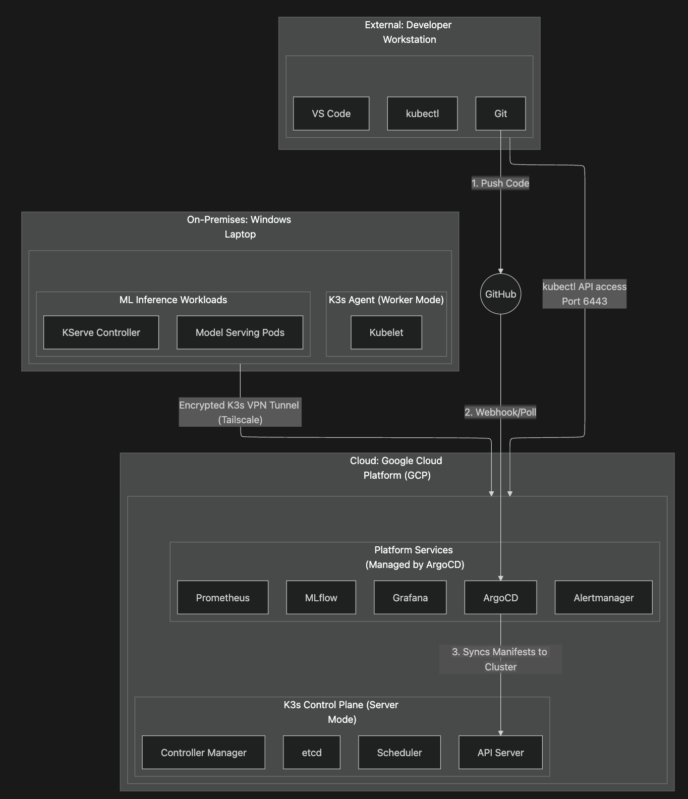
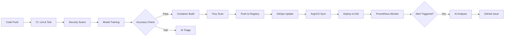
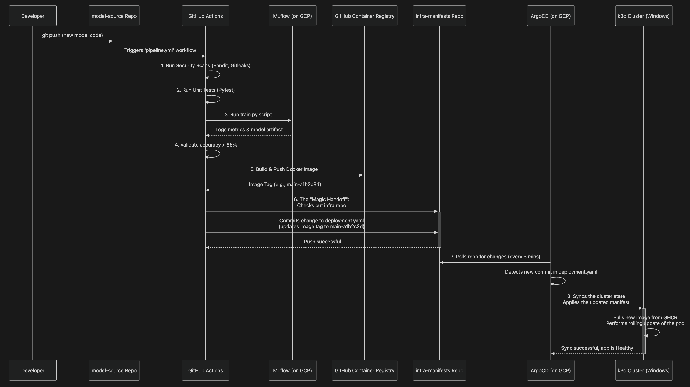

# AI-Augmented MLOps Platform
## Hybrid Cloud-Edge Machine Learning Operations Platform with Intelligent Monitoring

[](https://github.com/Dycouzt/MLOps-AI-Homelab-Model-Source/actions)
[](https://opensource.org/licenses/MIT)

---

## Project Overview

A production-grade, hybrid MLOps platform demonstrating enterprise-level machine learning operations with AI-powered intelligent monitoring. The platform spans **cloud control plane (GCP)** and **on-premises edge nodes (k3d)**, orchestrated via GitOps and augmented with Google Gemini AI for operational intelligence.

**Key Innovation:** Uses Large Language Models (Gemini 2.5 Flash Lite) to provide intelligent root cause analysis, automated model drift detection, and pipeline failure triage - reducing Mean Time To Resolution (MTTR) by providing actionable insights to on-call engineers.

---

## Architecture



---

## ✨ Key Features

### AI-Augmented Operations (AIOps)
- **Intelligent Log Analysis**: Gemini AI analyzes production alerts and provides root cause hypotheses
- **Automated Pipeline Triage**: AI diagnoses CI/CD failures with specific fix instructions
- **Model Drift Detection**: AI-powered analysis of model performance degradation with remediation recommendations

### Modern CI/CT/CD Pipeline
- **Continuous Integration**: Automated linting, testing, and security scanning
- **Continuous Training**: Model training with validation gates (accuracy thresholds)
- **Continuous Deployment**: GitOps-based deployment via ArgoCD

### Security-First Approach (DevSecOps)
- **SAST**: Static security analysis with Bandit
- **SCA**: Dependency vulnerability scanning with Snyk
- **Secrets Detection**: Gitleaks prevents credential leaks
- **Container Scanning**: Trivy scans for OS/library vulnerabilities

### Observability & Monitoring
- **Multi-Cluster Monitoring**: Prometheus scrapes metrics from both GCP and on-premises clusters
- **Visualization**: Grafana dashboards for model performance and infrastructure health
- **Alerting**: Alertmanager routes alerts with intelligent AI analysis

### Hybrid Cloud Architecture
- **Cloud Control Plane**: Centralized management on GCP (low-cost e2-small instance)
- **Edge Workloads**: ML inference runs on-premises (simulated via k3d)
- **Secure Connectivity**: Tailscale mesh VPN for hybrid communication

---

## Project Structure (Model Source Repo)

```
MLOps-AI-Homelab-Model-Source/
├── .github/
│   └── workflows/                     
│       ├── ai-drift-detection.yml         # Detects ML model drift via Gemini AI analysis (manual trigger)
│       ├── ai-log-analysis.yml            # Analyzes logs from failed pods using Gemini API (alert-triggered)
│       ├── ai-pipeline-triage.yml         # Automatically triages pipeline failures using LLMs
│       └── ci-ct-cd.yml                   # Core CI/CT/CD pipeline
├── app.py                                 # Main application entrypoint (model inference service)
├── train.py                               # Training script
├── requirements.txt                       
├── requirements-dev.txt                   # Development dependencies (testing, linting, etc.)
├── tests/
│   └── test_model.py                      # Unit tests
├── assets/
│   ├── architecture.png                   
│   └── diagram.png                        
├── docs/
│   ├── AI_DRIFT_DETECTION.md              # Documentation for AI drift detection workflow
│   ├── AI_LOG_ANALYSIS.md                 # Documentation for AI-powered log analysis pipeline
│   ├── AI_PIPELINE_TRIAGE.md              # Documentation for pipeline failure triage process
│   ├── ARCHITECTURE.md                    # Overview of system and component interactions
│   ├── MODEL.md                           # Details on model design, training, and parameters
│   ├── TESTING.md                         # Test strategy and coverage notes
│   └── TROUBLESHOOTING.md                 # Common issues and resolution steps
├── Dockerfile                             
└── README.md                              
```

---

## Technology Stack I Used

| Category | Technologies |
|----------|-------------|
| **Orchestration** | Kubernetes (k3s), k3d |
| **Cloud** | Google Cloud Platform (Compute Engine, Vertex AI) |
| **GitOps** | ArgoCD |
| **CI/CD** | GitHub Actions |
| **ML Tools** | MLflow, scikit-learn |
| **Monitoring** | Prometheus, Grafana, Alertmanager |
| **Security** | Bandit, Snyk, Gitleaks, Trivy |
| **AI Integration** | Google Gemini 2.5 Flash Lite API |
| **Networking** | Tailscale VPN |
| **Containers** | Docker, GitHub Container Registry |

---

## Pipeline Workflow

### End-to-End ML Lifecycle


---

### Workflow Diagram




### Pipeline Stages

1. **Code Quality** (Flake8 linting, Pytest unit tests)
2. **Security Scanning** (SAST, SCA, Secrets, Container CVEs)
3. **Model Training** (scikit-learn, MLflow tracking)
4. **Model Validation** (Accuracy threshold: 85%)
5. **Containerization** (Multi-stage Docker build)
6. **Deployment** (GitOps via ArgoCD to k3d cluster)
7. **Monitoring** (Prometheus metrics, Gemini AI analysis)

---

## AI Integration Details

### 1. Intelligent Log Analysis
**Trigger:** Prometheus alert fires (pod crash, high latency, OOMKilled, etc.)  
**Process:**
- Fetch pod logs and Kubernetes events
- Send to Gemini with structured prompt
- Generate markdown report with:
  - Root cause hypothesis (ranked by probability)
  - Impact assessment
  - Immediate actions
  - Prevention recommendations

**Result:** GitHub Issue created with AI analysis

### 2. Pipeline Failure Triage
**Trigger:** Any CI/CD workflow failure  
**Process:**
- Extract failure logs and context
- Classify failure type (security, testing, training, container)
- Send specialized prompt to Gemini
- Generate fix instructions with specific commands/code

**Result:** GitHub Issue with step-by-step remediation

### 3. Model Drift Detection
**Trigger:** Manual (or Prometheus accuracy alert)  
**Process:**
- Fetch MLflow metrics (current vs. baseline)
- Analyze historical trend
- Send to Gemini with performance data
- Classify drift type (data/concept/decay)
- Recommend retraining strategy

**Result:** GitHub Issue with drift analysis and urgency classification

---

## Monitoring & Alerting

### Prometheus Alert Rules

| Alert | Condition | Severity | Action |
|-------|-----------|----------|--------|
| ModelPodNotRunning | Pod not in Running state > 2min | Critical | AI log analysis |
| ModelPodFrequentRestarts | >0.1 restarts/15min | Warning | AI log analysis |
| ModelPodOOMKilled | Pod terminated by OOM | Critical | AI log analysis |
| ModelHighCPUUsage | >80% CPU for 5min | Warning | Monitoring |
| ModelHighMemoryUsage | >90% memory for 5min | Warning | Monitoring |

---

## Security & Compliance

### Security Measures
- ✅ Non-root container users
- ✅ Multi-stage Docker builds (minimal attack surface)
- ✅ Automated vulnerability scanning at every stage
- ✅ Secret management via GitHub Secrets
- ✅ Network segmentation (Tailscale VPN)
- ✅ GitOps audit trail (all changes in Git)

### Compliance & Best Practices
- Infrastructure as Code (IaC)
- Immutable infrastructure
- Shift-left security
- Automated testing gates
- Least privilege access
- Embrace GitOps Philosophy

---

## Project Metrics

| Metric | Value |
|--------|-------|
| **Pipeline Stages** | 7 automated stages |
| **Security Scans** | 4 types (SAST, SCA, Secrets, Container) |
| **AI Workflows** | 3 intelligent automation workflows |
| **Deployment Time** | ~5 minutes (commit to production) |
| **Clusters Managed** | 2 (GCP + on-premises) |
| **Monitoring Targets** | Multi-cluster Prometheus scraping |
| **Cost** | ~$6.50 for 2-week project + $0 for Gemini (free tier) |

---

## Skills Showcase

### Platform Engineering
- Multi-cluster Kubernetes management
- Hybrid cloud architecture design
- Infrastructure automation
- GitOps implementation

### MLOps
- End-to-end ML pipeline design
- Model versioning and registry (MLflow)
- Continuous training workflows
- Model drift monitoring

### DevOps / DevSecOps
- Integrated security scanning
- Vulnerability management
- Compliance automation
- Supply chain security

### AIOps
- LLM integration for operations
- Intelligent alert contextualization
- Automated triage and remediation
- Prompt engineering for operational use cases

### Site Reliability Engineering (SRE)
- Observability implementation
- Alert design and management
- Incident response automation
- MTTR reduction strategies

---

## Repository Links

- **Model Source Repo**: [MLOps-AI-Homelab-Model-Source](https://github.com/Dycouzt/MLOps-AI-Homelab-Model-Source)
- **Infrastructure Manifests**: [MLOps-AI-Homelab-Infra-Manifests](https://github.com/Dycouzt/MLOps-AI-Homelab-Infra-Manifests)

---

## Quick Start

### Prerequisites
- GCP account (e2-small / medium instance)
- Docker Desktop
- kubectl
- Tailscale account
- GitHub account
- On premises PC with at least 6 RAM free available

### Setup Instructions

1. **Deploy GCP Control Plane**
   ```bash
   # Provision GCP VM
   gcloud compute instances create k3s-control-plane \
      --project=<PROJECT_ID> \
      --zone=us-west1-b \
      --machine-type=e2-medium \
      --image-family=ubuntu-2204-lts \
      --image-project=ubuntu-os-cloud \
      --boot-disk-size=30GB \
      --boot-disk-type=pd-standard \
      --tags=k3s-server´
   
   # Install k3s
   curl -sfL https://get.k3s.io | sh -s - server \
      --write-kubeconfig-mode 644 \
      --disable traefik \
      --tls-san $(curl -s ifconfig.me)
   ```

2. **Setup On-Premises Worker**
   ```bash
   # Create k3d cluster
   k3d cluster create ml-worker \
      --servers 1 \
      --agents 1 \
      --api-port 0.0.0.0:6550 \
      --port "8080:80@loadbalancer" \ 
      --port "8443:443@loadbalancer" \ 
      --port "30808:30808@agent:0" \  # Maps NodePort 30808 to Windows localhost:30808
      --port "30809:30809@agent:0" \  # For future applications
      --port "30850:30850@agent:0" \  # For KServe inference services
      --port "30900:30900@agent:0" \  # For Prometheus scraping
      --k3s-arg "--disable=traefik@server:*" \
      --k3s-arg "--tls-san=100.xxx.xxx.xxx8@server:*" # Adds Tailscale IP to TLS certificate (IMPORTANT)
   ```

3. **Configure GitOps**
   ```bash
   # Install ArgoCD
   kubectl apply -n argocd -f \
     https://raw.githubusercontent.com/argoproj/argo-cd/stable/manifests/install.yaml
   
   # Register k3d cluster
   argocd cluster add k3d-ml-worker
   ```

4. **Deploy Platform Services**
   ```bash
   kubectl apply -f platform/mlflow/
   kubectl apply -f platform/monitoring/
   ```

5. **Test the Pipeline**
   ```bash
   # Make any change to the code and push
   git add . && git commit -m "Trigger pipeline" && git push
   ```

---

## Documentation

- [Architecture Deep Dive](docs/ARCHITECTURE.md)
- [AI Drift Detection Guide](docs/AI_DRIFT_DETECTION.md)
- [AI Log Analysis Guide](docs/AI_LOG_ANALYSIS.md)
- [AI Pipeline Traige Guide](docs/AI_PIPELINE_TRIAGE.md)
- [Troubleshooting](docs/TROUBLESHOOTING.md)

## Acknowledgments

- **ArgoCD Team**: For GitOps excellence
- **MLflow Community**: For ML lifecycle tools
- **Prometheus/Grafana**: For observability infrastructure
- **Google Cloud**: For Gemini AI API
- **CNCF**: For Kubernetes and cloud-native ecosystem

---

## Author

**Dycouzt** - Diego Acosta
